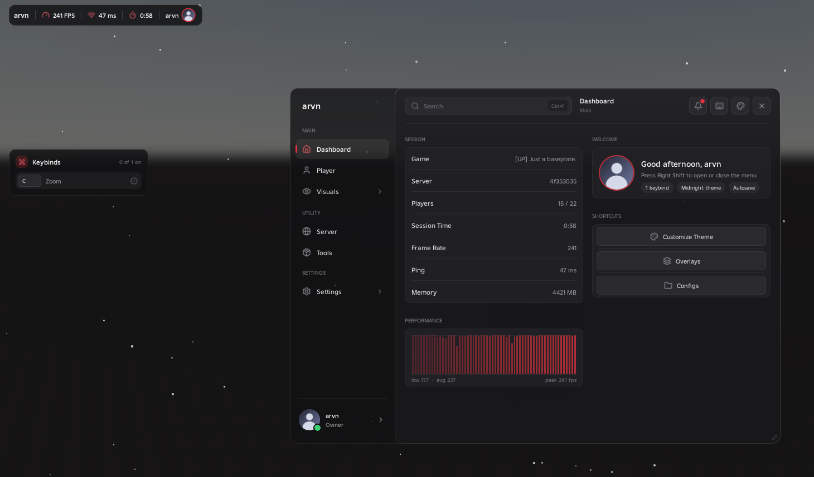
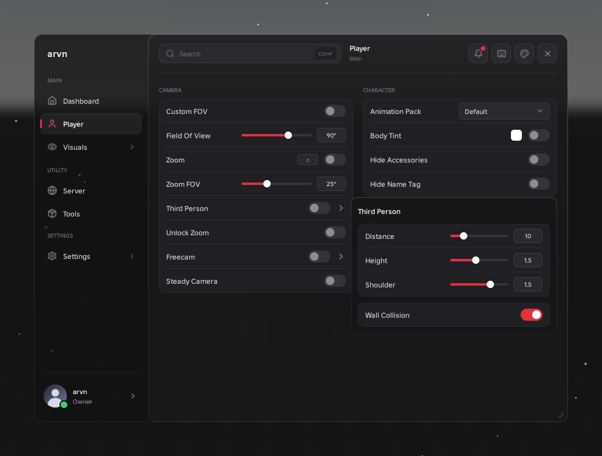
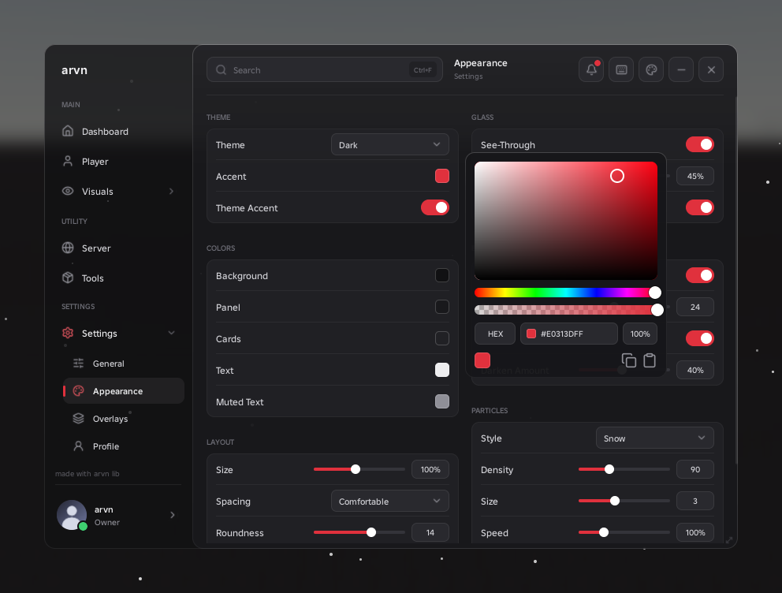
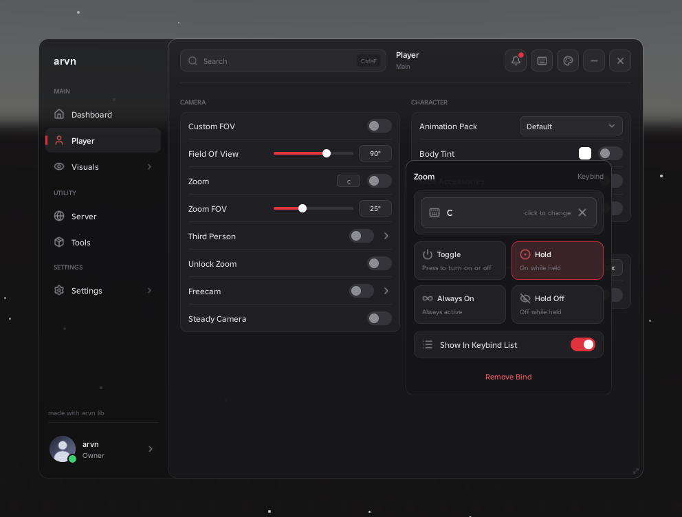
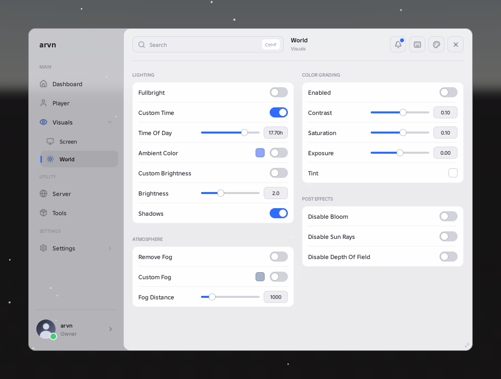
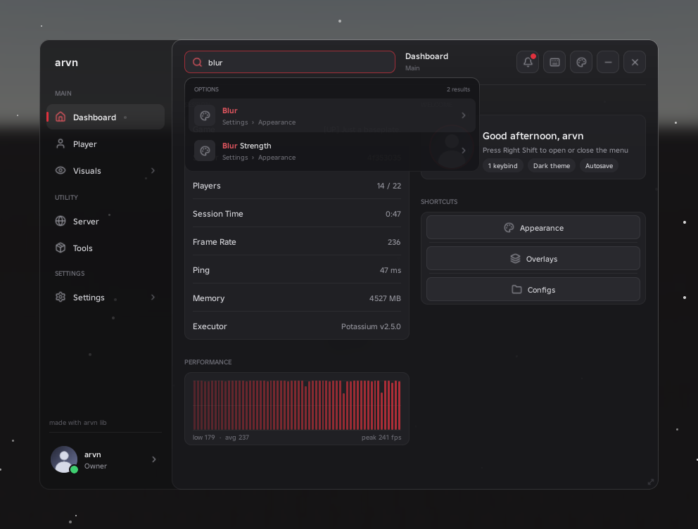
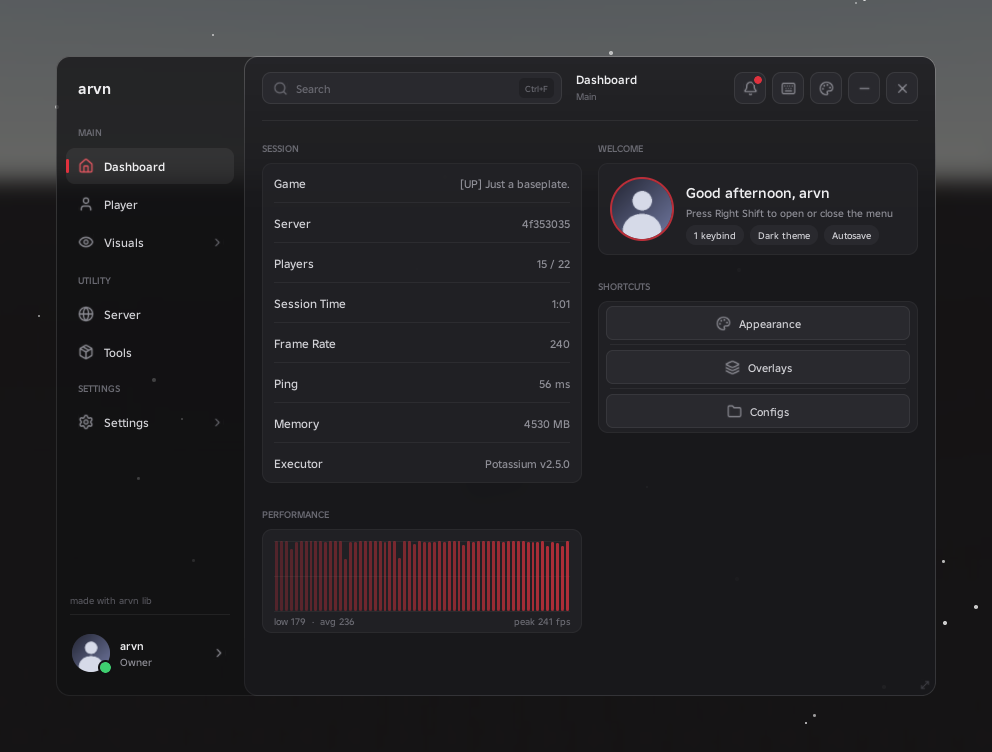

<p align="center">
  
</p>

<h1 align="center">arvn lib</h1>

<p align="center">UI library for Roblox.</p>

<p align="center">
  <a href="docs/getting-started.md">Getting started</a>
  &nbsp;·&nbsp;
  <a href="docs/elements.md">Elements</a>
  &nbsp;·&nbsp;
  <a href="docs/customization.md">Customization</a>
  &nbsp;·&nbsp;
  <a href="docs/icons.md">Icons</a>
  &nbsp;·&nbsp;
  <a href="docs/reference.md">Reference</a>
  &nbsp;·&nbsp;
  <a href="example.lua">Example</a>
</p>

<br>

```lua
local Arvn = loadstring(game:HttpGet("https://raw.githubusercontent.com/koteqjjjj/arvn/main/arvn.lua"))()
```

<br>

<table>
  <tr>
    <td></td>
    <td></td>
  </tr>
  <tr>
    <td></td>
    <td></td>
  </tr>
  <tr>
    <td></td>
    <td></td>
  </tr>
</table>

## Example

```lua
local Arvn = loadstring(game:HttpGet("https://raw.githubusercontent.com/koteqjjjj/arvn/main/arvn.lua"))()

local Window = Arvn:CreateWindow({Title = "My Script", Author = "you", Folder = "MyScript"})

local Main = Window:Group("Main")
local Player = Main:Tab({Name = "Player", Icon = "user"})
local Movement = Player:Section("Movement")

local speed = Movement:Toggle({Name = "Speed", Keybind = "V", Callback = function(on) end})
Movement:Slider({Name = "Walk Speed", Min = 16, Max = 100, Default = 32, ShowWhen = speed})
Movement:Button({Name = "Reset", Callback = function() end})
```

The full example is in [example.lua](example.lua).

## Credits

arvn lib by [koteqjjjj](https://github.com/koteqjjjj). Icons by [Lucide](https://lucide.dev).
