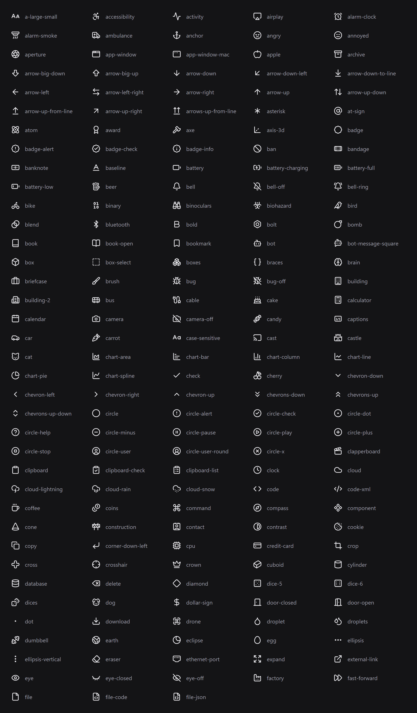
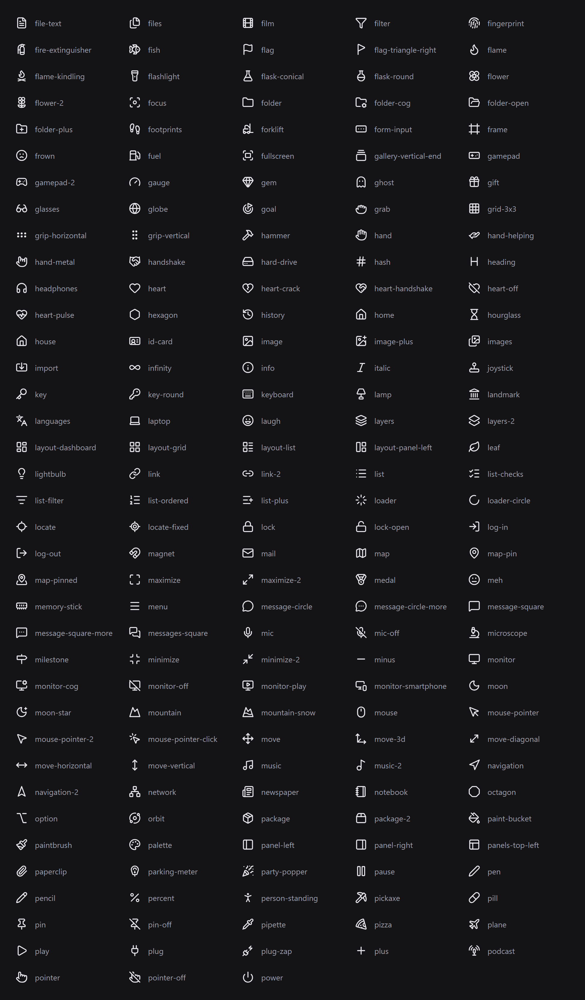
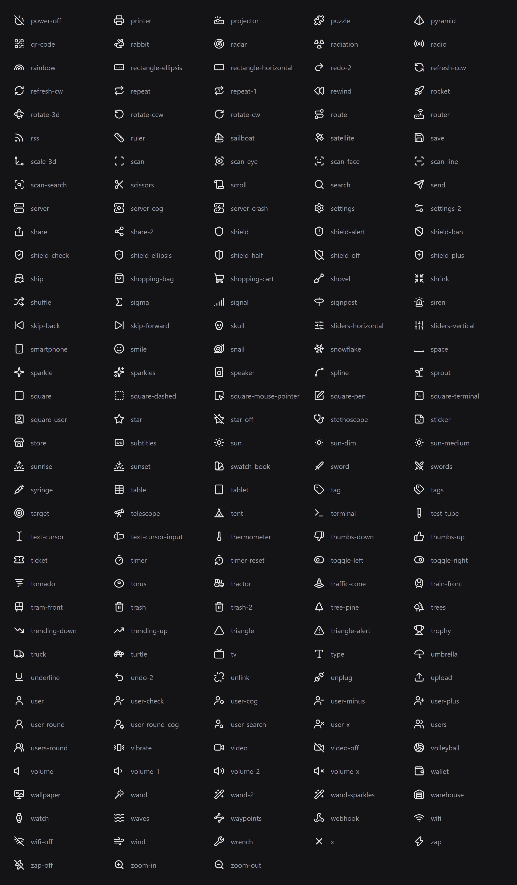

# Icons

Tabs, sub-tabs, elements and notifications take an `Icon`. Use a name from the list below.

```lua
Main:Tab({Name = "Aim", Icon = "crosshair"})
Aim:SetIcon("target")
```

## Common picks

| Tab | Icon |
|---|---|
| Aim | `crosshair`, `target` |
| Combat | `swords`, `sword`, `shield` |
| Visuals | `eye`, `scan-eye` |
| Movement | `footprints`, `gauge`, `zap` |
| Player | `user`, `person-standing` |
| World | `globe`, `sun`, `mountain` |
| Teleports | `map-pin`, `compass` |
| Farming | `pickaxe`, `sprout`, `repeat` |
| Shop | `shopping-cart`, `coins`, `gem` |
| Misc | `package`, `sparkles` |
| Settings | `settings`, `sliders-horizontal` |

You can also write the tab's word instead of the icon name: `aim`, `combat`, `pvp`, `weapons`, `guns`, `visuals`, `esp`, `movement`, `speed`, `player`, `players`, `character`, `world`, `teleport`, `farm`, `autofarm`, `shop`, `money`, `items`, `inventory`, `misc`, `fun`, `troll`, `game`, `scripts`, `exploits`, `targets`, `stats`, `vehicle`, `config`, `keybinds`, `audio` and `credits`.

Names don't care about capitals or spaces, so `"Gamepad 2"` works too.

## Your own image

```lua
Main:Tab({Name = "Aim", Icon = "https://files.catbox.moe/abc123.png"})
Main:Tab({Name = "Aim", Icon = "rbxassetid://1234567"})
Main:Tab({Name = "Game", Icon = "thumb:" .. game.PlaceId})
```

- A link must point straight to a PNG or JPG. It is downloaded once, saved, and shown in its own colors.
- Asset ids are colored like the built-in icons. Upload them white on a transparent background.
- `thumb:<place id>` shows that game's icon. `headshot:<user id>` shows a player's avatar.

If a name doesn't exist, the tab gets the default icon and the console shows a warning.

`Arvn:Icons()` returns every name.

## All icons






